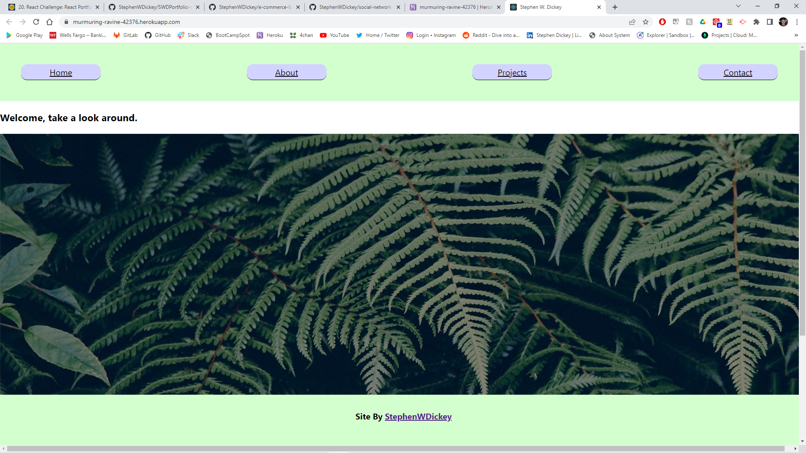

# SWDPortfolio-react

## Description 

Deployment: https://murmuring-ravine-42376.herokuapp.com/

GitHub page for project: https://github.com/StephenWDickey/SWDPortfolio-react

This week's challenge involved converting our portfolio into a SPA using React. You can find information about me, about projects i've done, and can find my contact information as well!

## Credits

Stephen Dickey - the author of this project (me).

GitHub page: https://github.com/StephenWDickey

Marcelo Gachet - Coding Bootcamp Instructor

Joseph Jepson - Coding Bootcamp tutor